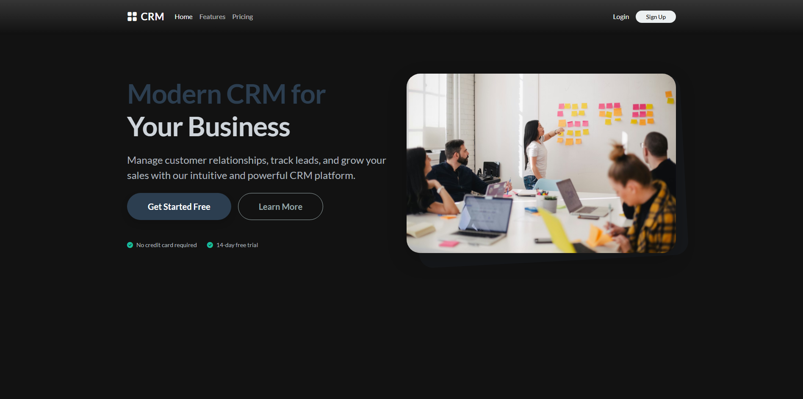
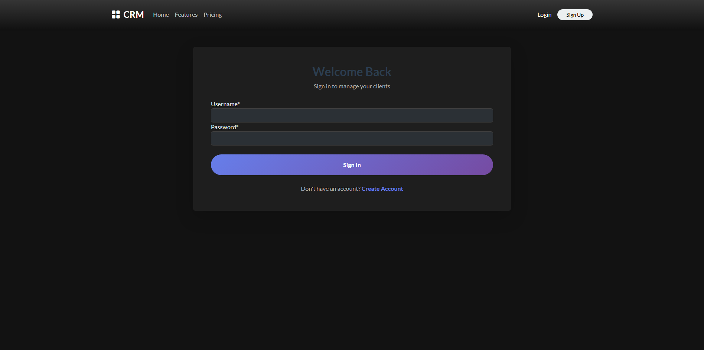
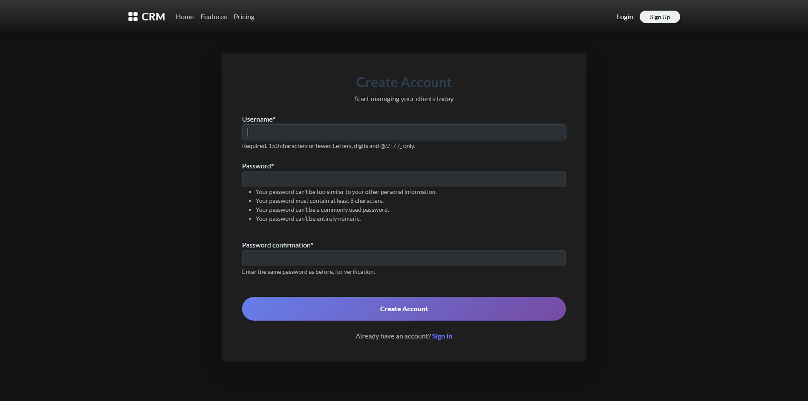
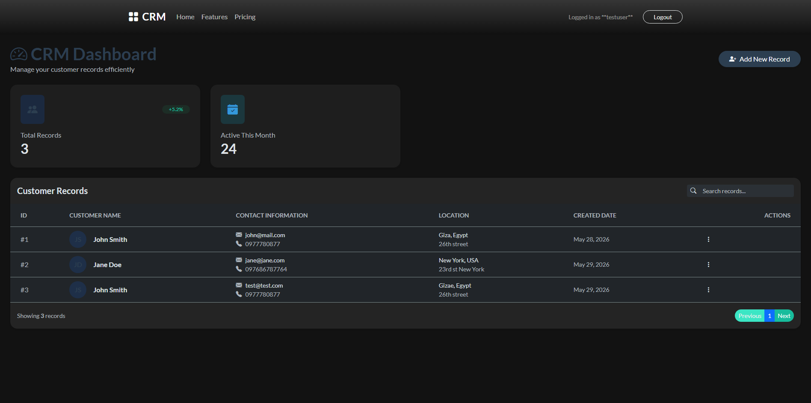
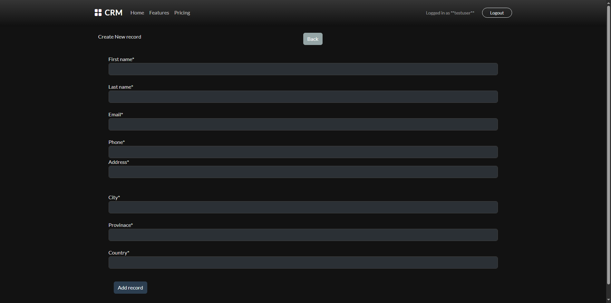
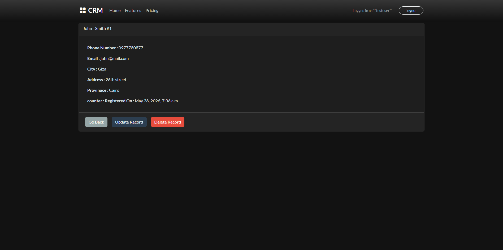
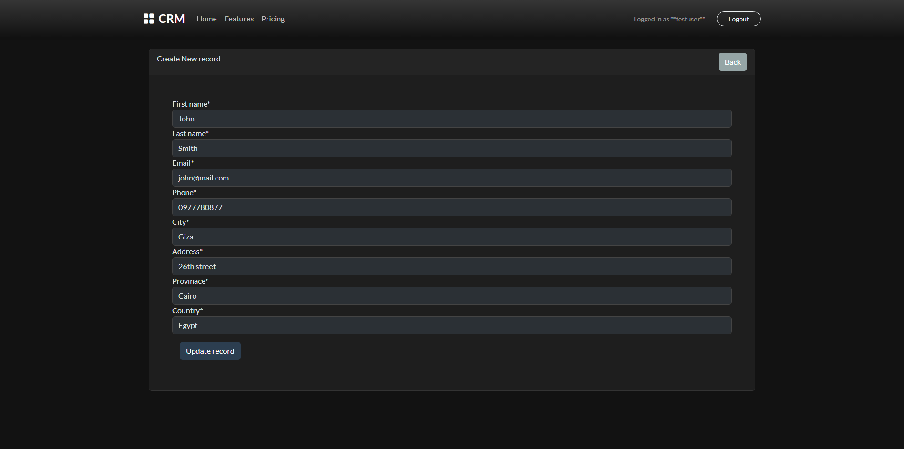

# Django CRM Application

A clean, modern, and secure Customer Relationship Management (CRM) application built using Django, Crispy Forms, and Bootstrap. This application allows users to register, log in, and manage customer/client records with full CRUD (Create, Read, Update, Delete) capabilities.

---

## 🚀 Features

- **User Authentication**: Secure user registration, login, and logout.
- **Client Records Management**:
  - View all client records on a dynamic dashboard.
  - View detailed information for a specific record.
  - Add new records.
  - Edit/update existing records.
- **Clean Responsive UI**: Modern design featuring card components, shadows, custom styling, and responsive layout.

---

## 🛠️ Tech Stack

- **Backend**: Django 5.2.x / Python
- **Database**: SQLite3
- **Frontend**: HTML5, Bootstrap 4/5, Crispy Forms
- **Authentication**: Django Built-in Auth System

---

## 📸 Application Screens

Here are the different screens captured from the running application:

### 🏠 1. Home Page
*The landing page welcoming users to the CRM application.*


### 🔑 2. Login Page
*A sleek login screen for user authentication.*


### 📝 3. Register Page
*Allows new users to register and create a CRM account.*


### 📊 4. Dashboard
*The central dashboard displaying all existing records in a structured table format with action links.*


### ➕ 5. Add Record Page
*Form for adding a new customer record to the database.*


### 🔍 6. View Record Page
*Detailed card view showing all the information for a specific customer.*


### ✏️ 7. Update Record Page
*Pre-populated form for editing and updating client details.*


---

## ⚙️ Setup and Installation

### 1. Clone the Repository
```bash
git clone <repository-url>
cd <repository-folder>
```

### 2. Install Dependencies
Make sure Python and pip are installed, then install Django and other packages:
```bash
pip install Django django-crispy-forms crispy-bootstrap4
```

### 3. Run Migrations
Run the migrations to create the database schema:
```bash
python manage.py migrate
```

### 4. Create a Superuser (Optional)
To access the Django Admin panel:
```bash
python manage.py createsuperuser
```

### 5. Start the Development Server
```bash
python manage.py runserver
```
Visit the application in your browser at `http://127.0.0.1:8000/`.
